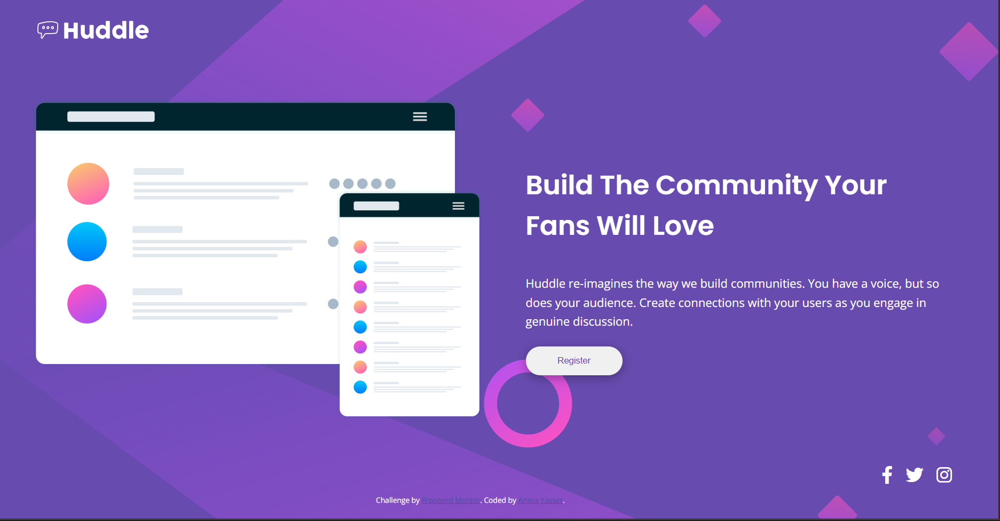

# Huddle Landing Page 

This is my solution to the Frontend Mentor Huddle landing page challenge. It's a responsive landing page that adapts beautifully across all device sizes while maintaining visual harmony and accessibility.

##  Overview

The Huddle landing page is designed to showcase a community platform where users can create and engage with meaningful discussions. This implementation focuses on delivering a pixel-perfect, responsive design while ensuring optimal performance and accessibility.

### Key Features

- ✨ Fully responsive design from 320px to 1440px+ screens
- 🎨 Dynamic background patterns that adapt to screen size
- 💫 Smooth hover animations on interactive elements

  

##  Built With

- Semantic HTML5 markup
- Modern CSS features:
  - CSS Grid
  - Flexbox
  - Custom Properties
  - Media Queries

##  What I Learned

This project helped me strengthen my understanding of:

- CSS Grid layout system
- Responsive design principles
- CSS custom properties
- Accessibility best practices

##  Acknowledgments

- Frontend Mentor for providing the challenge
- The coding community for their support and feedback
